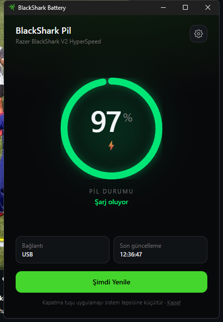

# BlackShark Battery (Tauri + React)

Razer BlackShark V2 HyperSpeed pil göstergesi. Razer Synapse gerekmez; pil
seviyesi doğrudan HID üzerinden okunur.



## Özellikler

- Koyu tema, halka göstergeli arayüz (yeşil ≥ %50, sarı %20-49, kırmızı < %20)
- "Şimdi Yenile" butonu ve ayarlar modalı
- Kapatma (X) ve küçültme (minimize) tuşu pencereyi tamamen yok eder; WebView2
  süreçleri kapanır, uygulama tepside yaşamaya devam eder
- Tepsiden "Göster" veya sol tık pencereyi sıfırdan yeniden oluşturur
- Tepsi menüsü: pil yüzdesi başlığı + Göster / Ayarlar / Çıkış (seçili dile göre)
- Ölçüm: pencere açıkken 7 süreç / ~368 MB, tepsideyken 1 süreç / ~2.6 MB
- Yenileme aralığı: 10 / 30 / 60 / 300 saniye, değişiklik anında uygulanır
- Windows açılışında otomatik başlatma (`--minimized` ile tepside açılır)
- Ayarlar `tauri-plugin-store` ile diske yazılır (`settings.json`)
- Türkçe / İngilizce dil desteği (i18next)

## Kurulum

```powershell
cd blackshark-desktop
npm install
```

Kullanılan ek paketler:

```powershell
npm install tailwindcss @tailwindcss/vite i18next react-i18next @tauri-apps/plugin-autostart
cargo add tauri-plugin-autostart --manifest-path src-tauri/Cargo.toml
cargo add tauri --features tray-icon,image-png --manifest-path src-tauri/Cargo.toml
```

## Geliştirme

```powershell
npm run tauri:dev
```

## Derleme (.exe)

```powershell
npm run tauri:build
```

Çıktılar `src-tauri/target/release` altında üretilir ve `release/` klasörüne
kopyalanmıştır:

| Dosya | Açıklama |
| --- | --- |
| `release/BlackSharkBattery.exe` | Taşınabilir tek dosya |
| `release/BlackShark Battery_0.1.0_x64-setup.exe` | NSIS kurulum sihirbazı |
| `release/BlackShark Battery_0.1.0_x64_en-US.msi` | MSI paketi |

## İkon

`scripts/prepare_icon.py` verilen Razer PNG'sinden beyaz zemini kaldırıp
Razer yeşiline boyar ve `app-icon.png` üretir:

```powershell
python scripts/prepare_icon.py "$env:USERPROFILE\Downloads\razer.png"
npm run icon
```

## Notlar

- Windows 11 yeni tepsi ikonlarını varsayılan olarak taşma (overflow) alanına
  koyar. İkonu kalıcı görünür yapmak için `^` menüsünden görev çubuğuna
  sürükleyin.
- Pencere tepsideyken arka plan sorgusu Rust tarafında devam eder; webview'a
  olay gönderilmediği için gereksiz render yapılmaz.
- Pencere yok edildiği için React state'i sıfırlanır. `src/hooks/usePersistentState.ts`
  içindeki `usePersistentState` hook'u state'i `localStorage`'a yansıtır ve
  pencere kapanmadan hemen önce son hâlini yazar.
- `src/hooks/useVisibility.ts` içindeki `useVisibility` / `useVisibleInterval`
  hook'ları `document.visibilityState` üzerinden arka plan render ve
  interval'larını durdurmak için kullanılabilir. Mevcut bileşenlere bağlı
  değildir; ihtiyaç duyduğunuz yerde import etmeniz yeterli.
- Pil okuma mantığı `src-tauri/src/battery.rs` içinde ve değiştirilmedi.
